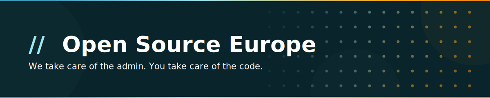

---

Open Source Europe is a European nonprofit that gives open source projects a shared fiscal and legal home — so you can receive donations, manage expenses, and operate transparently **without becoming a legal entity yourself**.

Your project stays fully autonomous. We handle the structure. You handle the vision.

- 📊 **Radical transparency** — every budget is public
- 🇪🇺 **EU-compliant nonprofit** — eligible for European and US-based funding
- 📋 **No paperwork** — we handle the admin so you don't have to
- 🔒 **Your project, your rules** — full autonomy guaranteed

Most projects are live within a week.

---

### Our goal is to make Open Source Europe feel like a place you **belong to** — not a service you use.

We are just getting started, and we're building this in the open.  
**Now is the best time to show up and shape what this becomes.**

[💬 Share ideas & ask questions](https://github.com/opensourceeurope/community/issues) · [🎮 Join us on Discord](https://discord.gg/c9fYn44jev)

